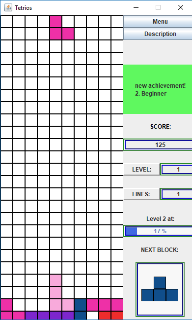
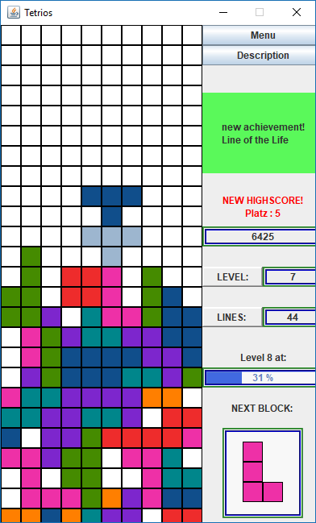

# Tetrios  

This project is a clone of the game Tetris, which I implemented with a friend in Java.  
To run the jar file please have Java JRE at least version 1.8 (8u20) installed.  

<a href="./examples/Tetrios_Trailer.mp4.mp4" style="font-size:22px">Trailer</a>

  
**Please note: to see icons in the game please have the folder "Bilder" on the same level as the file Tetrios_1.2.jar.**

If you have questions or want to report a bug, please send an email to tobiasfox@gmx.net.